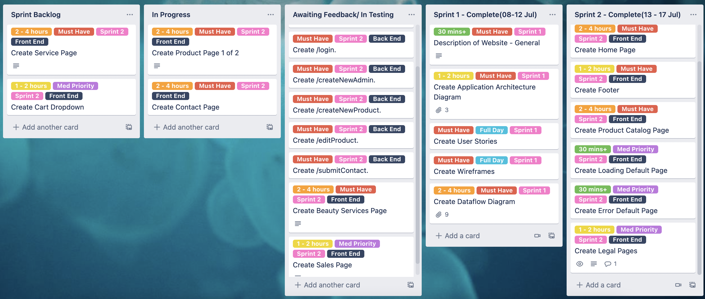

# Jeremy Tuesley & Sasha Zahnitko - Term 3 Assessment 2

As an aspiring developer, it is important to be able to communicate and demonstrate your abilities to prospective employers.

A full stack developer needs to be able to demonstrate they can build a complete application from design through to deployment for a commercial client (using appropriate tools and methodologies).

You are to design a web application (app) built for a real world customer.

Find a business or organisation (preferably near Coder Academy) to build an app for.

Meet with the business owner or organisation manager to find out what challenges they face. Find a problem that you can solve with an app and present your ideas to the client.

The project must be completed in the assigned groups.

## Table of Contents:

- [Links](#Links)
- [Description of your website](#Description-of-your-website)
- [Dataflow Diagram](#Dataflow-Diagrams)
- [Application Architecture Diagram](#Application-Architecture-Diagram)
- [User Stories](#User-Stories)
- [Wireframes](#Wireframes)
- [Trello Screenshots](#Trello-Screenshots)

#

## Links

- [GitHub Repository-Client](https://github.com/jeremytuesley/XLExtends-Client)
- [GitHub Repository-API](https://github.com/jeremytuesley/XLExtends-API)
- [Trello Board](https://trello.com/b/dtnqkG0x/xlextends-project-management)

#

## Description of your website

## Purpose

To assist a growing small business owner, moving from etsy, into having their own website that functions as an online sales and booking platform.

## Main Functionality/ Features

- Storefront
- Product Catalog
- Stripe payment system
- Shopping cart
- Product customer customization
- Contact form
- Terms & Conditions, Refund policy, Privacy policy

### Features to Improve Functionality

- Booking System, includes availability
- Appliable discount codes
- Admin panel
- Promotional, social media integration

## Target Audience

16 and above, people interested in lashes, artwork

## Tech Stack

### Front-end:

- HTML
- SCSS
- CSS
- JS
- React

### Back-end:

- Node
- Express

Testing:

### Front End

- Cypress

### Back end

- Mocha
- Chai
- Supertest

## Database:

- MongoDB

## Image Hosting:

- Cloudinary

## API Technology:

- GraphQL

## Deployment:

- Heroku

## Source Control:

- GitHub

#

## Dataflow Diagrams

### Admin Product Interaction

### Admin Login

### Customer Booking

### Customer Contact

### Payment

### Customer Product Interaction

#

## Application Architecture Diagram

#

## User Stories

As a business owner, I want to have access to an admin panel, so that I can CRUD products and bookings.

As a business owner, I want to be able to highlight/ feature products as sale items, so that potential customers have an easy way of viewing them

As a business owner, I want bookings to have a fee, so that customers are more inclined to show up to the appointment.

As a business owner, I want my products to be purchasable through the website, so that payment is handled online.

As a business owner, I want only some products to be able to be customized, so it’s clear when products are either set, or customizable.

As a business owner, I want an available pickup location displayed, so that customers know where they are able to pick up a purchased product from.

As a business owner, I want there to be discount codes, so that customers are more inclined to purchase the relevant product.

As a customer, I want to be able to view legal policies (e.g refund policy, terms & conditions, etc), so that I know where I stand if something goes wrong with receiving a purchased product.

As a user who wants to book a service, I want to be able to see available/ unavailable booking sessions, so that I can book an available appointment.

As a user who wants to purchase a product, I want payment to be afterpay compatible, so that I have time to pay the product off.

As a user who wants to purchase a product, I want to be able to customise a product I’m ordering, so that the product is personalised towards me.

As a user who wants to purchase a product, I want to be able to view a list of products, so that I know what is available to purchase.

As a user who wants to access the website, I want it to be mobile compatible, so that I can view it nicely on mobile.

As a user who wishes to navigate the website, I want a user-friendly navigation bar, so that I can peruse the website easily.

As a user who wants to enquire about a product, I want to be able to contact the owner, so that I can further discuss information about the product.

#

## Wireframes

### Home Page

### Beauty Service

### Beauty Services

### Bookings

### Booking Confirmation

### Cart

### Catalog

### Contact

### Contact Confirmation

### Legal

### Product with Customization

### Product with no Customization

### Purchasing

### Purchasing Confirmation

#

## Trello Screenshots

